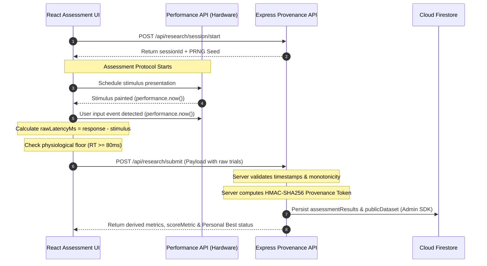

# PULSE System Architecture

This document describes the end-to-end architecture, runtime subsystems, data flow pipelines, and security boundaries of the PULSE platform.

---

## 1. System Topology Overview

PULSE consists of a dual-surface client layer (Desktop SPA + Mobile PWA) connected over REST/HTTPS to an Express Node.js application server, backed by Google Cloud Firestore and Firebase Authentication.

```mermaid
graph TD
    ClientDesktop["Desktop Client (React 19 / Vite)<br/>Route: /"] -->|HTTPS / JSON| Server["Express API & Provenance Engine<br/>(server.ts / Node.js)"]
    ClientMobile["Mobile PWA Client (React 19 / Vite)<br/>Route: /mobile/"] -->|HTTPS / JSON| Server

    Server -->|Admin SDK (Signed Writes)| Firestore[("Google Cloud Firestore")]
    Server -->|Token Verification| FirebaseAuth["Firebase Authentication<br/>(Anonymous Auth)"]

    ClientDesktop -.->|Read-Only Queries| Firestore
    ClientMobile -.->|Read-Only Queries| Firestore
```

---

## 2. Dual-Surface Frontend Architecture

PULSE separates desktop and mobile web experiences into distinct build pipelines while sharing protocol validation logic and data models.

```
/
├── src/                      # Desktop Web Client (Port 3000)
│   ├── App.tsx               # Root desktop router & AnimatedBackground
│   ├── main.tsx              # Desktop entry point
│   ├── components/           # Desktop assessment views, analytics, brand
│   └── lib/                  # State stores, timing tools, Firestore client
│
└── mobile/                   # Mobile PWA Subproject (Vite sub-config)
    ├── index.html            # Mobile-optimized viewport HTML
    ├── vite.config.ts        # Mobile Vite configuration
    └── src/                  # Mobile touch assessment views & PWA lifecycle
```

### Device Auto-Routing
- [`src/lib/deviceRouting.ts`](file:///c:/Users/affan/OneDrive/Documents/PULSE/v2.1%20GIT/src/lib/deviceRouting.ts) inspects User-Agent signatures and screen width breakpoints (`< 768px`).
- Express server middleware handles edge redirects between `/` and `/mobile/`.
- Cross-surface navigation allows manual override if a user explicitly requests the desktop or mobile interface.

---

## 3. Assessment Execution & Timing Pipeline

Measurement integrity is maintained through hardware-synchronized sampling:



---

## 4. State Management Architecture

State is partitioned across four clear tiers:
1. **In-Memory Volatile State:** [`src/lib/inMemorySessionStore.ts`](file:///c:/Users/affan/OneDrive/Documents/PULSE/v2.1%20GIT/src/lib/inMemorySessionStore.ts) holds active session trial arrays during assessment runs to prevent unnecessary I/O during timing loops.
2. **Local Client Storage:** [`src/lib/settingsStore.ts`](file:///c:/Users/affan/OneDrive/Documents/PULSE/v2.1%20GIT/src/lib/settingsStore.ts) manages user preferences (selected age cohort, reduced motion, sound effects, system dark/light theme) in `localStorage`.
3. **PWA Offline Store:** [`src/lib/pwaStore.ts`](file:///c:/Users/affan/OneDrive/Documents/PULSE/v2.1%20GIT/src/lib/pwaStore.ts) tracks install prompt readiness and service worker updates.
4. **Cloud Database:** Google Cloud Firestore holds persistent assessment trials, results, public datasets, leaderboards, and admin audit logs.

---

## 5. Server Subsystem & API Routing (`server.ts`)

The Express server handles five core operational domains:

```
[Express Server (server.ts)]
  │
  ├── 1. Rate Limiting Middleware
  │     ├── /api/admin/*              ──► generalApiLimiter (100 req / 15 min)
  │     ├── /api/admin/login          ──► adminLoginLimiter (5 req / 15 min)
  │     ├── /api/research/session/*   ──► sessionStartLimiter (30 req / 15 min)
  │     ├── /api/research/submit      ──► sessionSubmitLimiter (30 req / 15 min)
  │     └── /api/leaderboard/submit   ──► leaderboardSubmitLimiter (30 req / 15 min)
  │
  ├── 2. Provenance & Attestation Engine
  │     ├── /api/research/session/start ──► Session initialization
  │     ├── /api/research/submit        ──► Multi-trial validation & HMAC token signing
  │     ├── /api/research/verify-provenance ──► Token signature verification
  │     └── /api/personal-best          ──► High score queries
  │
  ├── 3. Public Dataset API
  │     ├── /api/research/dataset       ──► Filtered public benchmark queries
  │     └── /api/research/dataset/summary ──► Cohort summary statistics
  │
  ├── 4. Leaderboard API
  │     ├── /api/leaderboard            ──► Opted-in top 100 entries per protocol
  │     └── /api/leaderboard/submit     ──► Alias validation & leaderboard write
  │
  └── 5. Admin Console API
        ├── /api/admin/login            ──► Passcode verification & session token
        ├── /api/admin/leaderboard/hide ──► Soft-hide flagged submission
        ├── /api/admin/leaderboard/delete ──► Hard-delete fraudulent submission
        └── /api/admin/audit-logs       ──► Immutable moderation log retrieval
```

---

## 6. Firestore Security & Trust Boundaries

The Firestore database enforces strict role isolation via [`firestore.rules`](file:///c:/Users/affan/OneDrive/Documents/PULSE/v2.1%20GIT/firestore.rules):

| Collection | Client Read | Client Write | Server Backend (Admin SDK) |
| :--- | :--- | :--- | :--- |
| `experimentSessions` | Authenticated Owner (`uid == auth.uid`) | **DENIED** (`false`) | Full Read/Write |
| `assessmentTrials` | Authenticated Owner (`participantId == auth.uid`) | **DENIED** (`false`) | Full Read/Write |
| `assessmentResults` | Authenticated Owner (`participantId == auth.uid`) | **DENIED** (`false`) | Full Read/Write |
| `publicDataset` | Authenticated Users (`auth != null`) | **DENIED** (`false`) | Full Read/Write |
| `leaderboardResults` | Public (where `hidden == false`) | **DENIED** (`false`) | Full Read/Write |
| `adminAuditLogs` | **DENIED** (`false`) | **DENIED** (`false`) | Full Read/Write |
