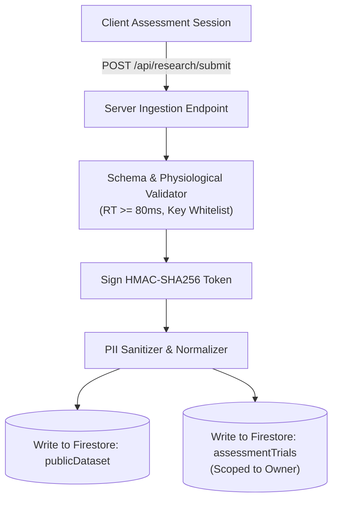

# PULSE Research Dataset Pipeline Specification

This document details the ingestion, sanitization, aggregation, and export pipelines powering the PULSE open research dataset.

---

## 1. Dataset Objectives & Ethical Governance
The PULSE Research Dataset Explorer (`/dataset`) provides an open empirical benchmark for cognitive science, human-computer interaction, and psychometric research.

### Zero-PII Guarantee
Every public observation complies with strict data minimization standards:
- **No IP Addresses:** Client IP addresses are processed in ephemeral memory for rate limiting and never written to Firestore.
- **No Participant Identifiers:** Firebase UIDs and session UUIDs are stripped during public dataset ingestion.
- **Coarse Temporal Aggregation:** Exact timestamps are replaced with `completedAtMonth` (`YYYY-MM`).
- **Broad Cohort Buckets:** Age is captured exclusively in 7 normalized brackets (`Children (8–12)` through `Seniors (76+)`).

---

## 2. Ingestion & Normalization Flow

---

## 3. Querying & Filtering Engine

The React hook [`src/lib/dataset/index.ts`](file:///c:/Users/affan/OneDrive/Documents/PULSE/v2.1%20GIT/src/lib/dataset/index.ts) (`useDatasetPipeline`) provides reactive data slicing:

### Filter Dimensions
1. **Assessment Protocol:** `visual-reaction`, `direction`, `colour-recognition`, `block-memory`, `number-memory`.
2. **Age Cohort:** Multi-cohort or single-cohort breakdown.
3. **Device Category:** `desktop` vs `mobile`.
4. **Time Range:** Filterable by completion month (`YYYY-MM`).

---

## 4. Export Formats

The Dataset Explorer supports instant one-click research exports:
- **CSV Export:** Tabular comma-separated values containing trial latencies, derived means, medians, consistency scores, and cohort labels.
- **JSON Export:** Full hierarchical structured representation matching `publicDataset` schema v1 for automated Python/R research scripts.
