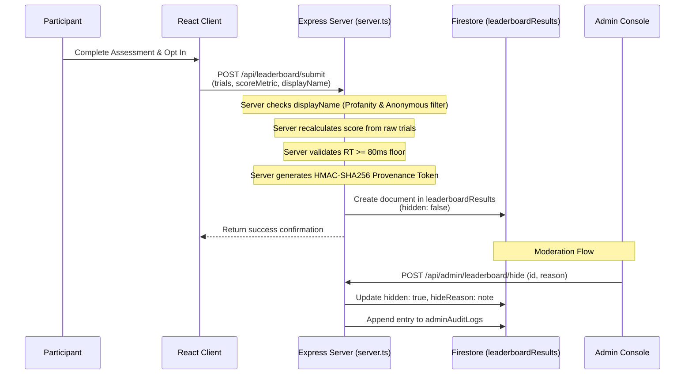

# PULSE Leaderboard & Cryptographic Provenance Specification

This document specifies the opt-in leaderboard workflow, anti-cheat validation pipeline, cryptographic HMAC attestation, and administrative moderation system.

---

## 1. Leaderboard Architecture

The PULSE leaderboard (`/leaderboard`) ranks the top 100 verified scores across each assessment protocol:

---

## 2. Opt-In & Alias Validation Rules
- **Explicit Consent:** Scores are never posted to public rankings without the participant completing the opt-in modal.
- **Anonymous Alias Rejection:** Generic pseudonyms (`Anonymous`, `Unknown`, `Guest`, `Participant-XXXX`) are barred from public rank tables to preserve genuine competitive transparency.
- **Profanity Filtering:** Nicknames are sanitized against offensive and abusive terminology.

---

## 3. Cryptographic Provenance Model
- **HMAC Secret:** The server generates a 64-character SHA-256 HMAC token calculated over:
  - `assessmentType`
  - `scoreMetric`
  - `ageGroup`
  - `timestamp`
  - Digest of raw trial observations
- **Verification Endpoint:** The server exposes `/api/leaderboard/verify-provenance` to allow independent cryptographic audits of any leaderboard record against the current signing key.

---

## 4. Administrative Moderation Controls
- **Soft-Hide (`/api/admin/leaderboard/hide`):** Sets `hidden = true` on flagged entries without deleting historical data. Soft-hidden entries are instantly filtered out of the public leaderboard query.
- **Hard-Delete (`/api/admin/leaderboard/delete`):** Permanently purges fraudulent or malicious entries from Firestore.
- **Audit Ledger (`adminAuditLogs`):** Every administrative hide/unhide/delete action records the acting administrator, target document ID, timestamp, and justification note into an immutable 7-year audit collection.
